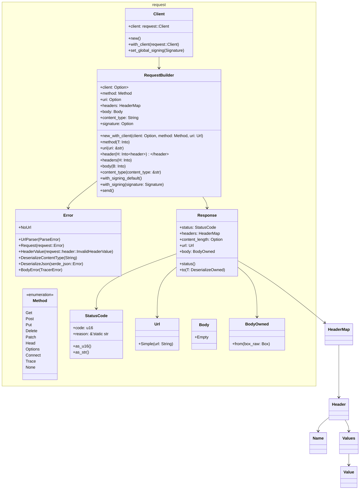
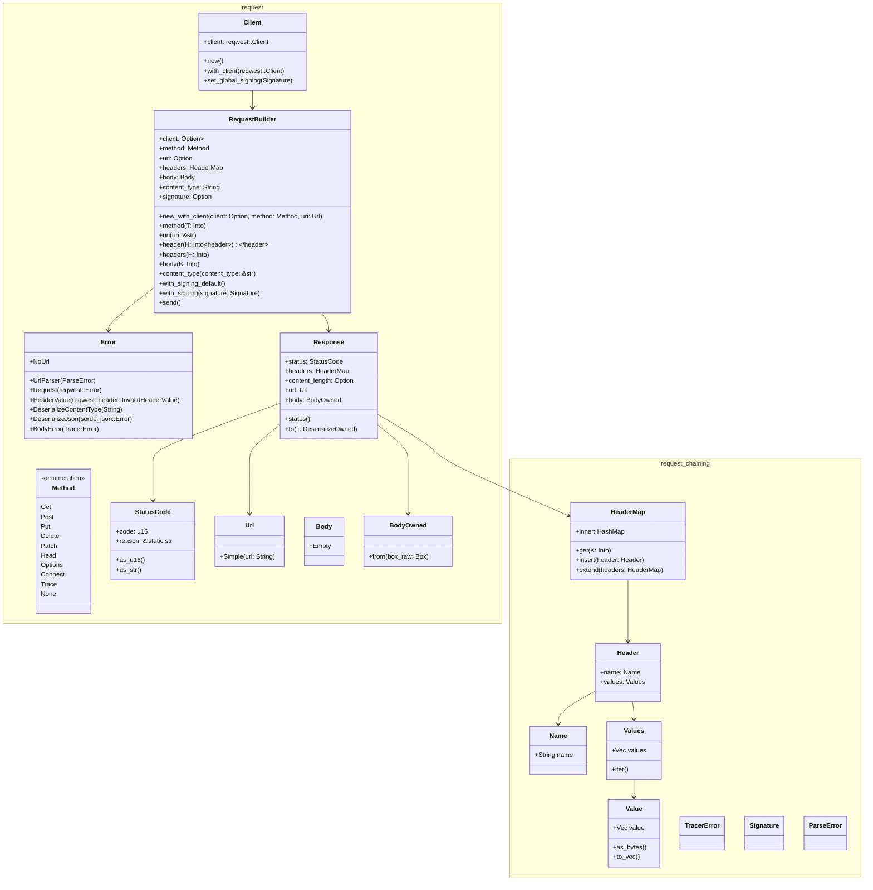
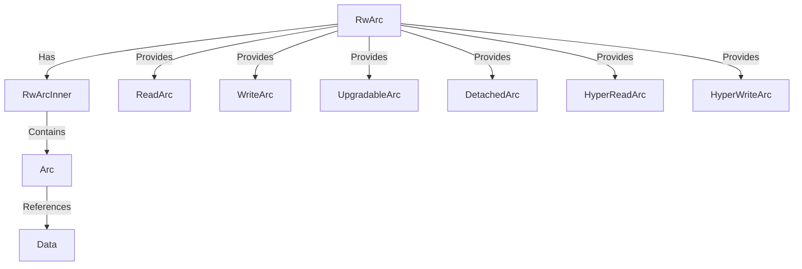
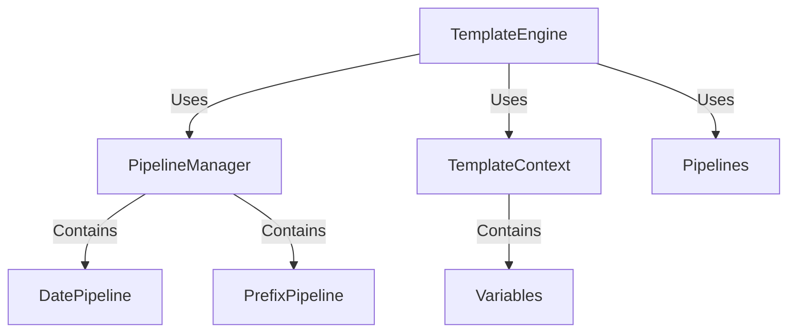

# gearbox


[](https://gitlab.nebula.technology/libraries/rust/gearbox/-/commits/main)
[](https://gitlab.nebula.technology/libraries/rust/gearbox/-/commits/main)
[](https://gitlab.nebula.technology/libraries/rust/gearbox/-/releases)

Gearbox is a versatile library that encompasses a wide array of functionalities, including networking, logging,
railway-oriented programming extensions, and time management. Initially designed as a collection of utilities, the
ultimate vision for Gearbox is to evolve into a highly optimized, standalone toolkit. The goal is to minimize external
dependencies progressively, leading to a library that is lightweight and efficient. By doing so, Gearbox aims to be
universally compatible, from embedded systems to WebAssembly (WASM) environments, all while maintaining simplicity and
minimizing the need for boilerplate code. This development strategy positions Gearbox as a comprehensive solution for
developers seeking to build efficient, scalable applications across a broad spectrum of platforms.

## Features

| Category   | Feature               | use                                     | Description                                                                                                                                                                                                                                                                                                                                                                                                     | Status |
|------------|-----------------------|-----------------------------------------|-----------------------------------------------------------------------------------------------------------------------------------------------------------------------------------------------------------------------------------------------------------------------------------------------------------------------------------------------------------------------------------------------------------------|--------|
| Common     | TryDefault            | gearbox::common::TryDefault             | This is a trait used internally in `Gearbox` defining a `TryDefault` trait that returns a Result<T,Self::Error>. It can also be used in other systems.                                                                                                                                                                                                                                                          | ✅      |
|            | BoxedFuture           | gearbox::common::BoxedFuture            | Type alias for a pinned boxed future. Used for returning dynamically dispatched futures.                                                                                                                                                                                                                                                                                                                        | ✅      |
| Error      | ErrorTracer           | gearbox::error::tracer::*               | An error structure that builds a traceable stack of errors. It allows breaking down the error into a TypeId to define the encapsulated error for further operations. Contains information about file, line, module path, and optional error_code with display and debug. This also comes with the macro `Error!()` which sets up the `ErrorTracerExtInfo` with all the needed information (file, line, module). | ⚠️     |
|            | Rail ErrorTracer      | gearbox::rails::ext::map_err_tracer     | Simplification for `map_err` for operating with the ErrorTracer, allowing for passing an `Error!()` or an `ErrorTracerExtInfo` for collecting all the information.                                                                                                                                                                                                                                              | ✅      |
| Logging    | Tracing Log Formatter | gearbox::log::fmt::*                    | Custom subscriber for formatting logs when using the rust Tracing library.                                                                                                                                                                                                                                                                                                                                      | ⚠️     |
| Networking | hostname              | gearbox::net::hostname                  | Get the hostname of the local machine.                                                                                                                                                                                                                                                                                                                                                                          | ✅      |
|            | HTTP Request          | gearbox::net::http::request             | Send an HTTP request. This is an extension on top of `Reqwest` that simplifies the implementation of mTLS and payload signing.                                                                                                                                                                                                                                                                                  | ⚠️     |
|            | HTTP Request Chaining | gearbox::net::http::request_chain       | Chaining system for HTTP requests, allowing for chaining requests and responses for more advanced request/response handling.                                                                                                                                                                                                                                                                                    | ❌      |
| Paths      | Common Paths          | gearbox::path::*                        | Common paths under Windows, Linux, and more. For example, under Linux, the config path is usually `~/.config/`.                                                                                                                                                                                                                                                                                                 | ✅      |
| Rails      | Common Extensions     | gearbox::rails::ext::*                  | Various extension traits for operating on `Result`, `Option`, and other standard types, providing additional methods for error handling, merging results, and tapping into values.                                                                                                                                                                                                                              | ⚠️     |
|            | Future Extensions     | gearbox::rails::ext::future::*          | Extensions for working with `Future` types, providing methods for mapping, chaining, and merging futures.                                                                                                                                                                                                                                                                                                       | ✅      |
| serde      | Dynamic Serialization | gearbox::serde::dynamic::*              | Dynamic serialization system that allows for encoding and decoding of multiple formats. This is a simplified version of the serde library.                                                                                                                                                                                                                                                                      | ⚠️     |
|            | Wasm Bindgen Ser/de   | gearbox::serde::wasm_bindgen::*         | Implementation for WASM Bind Generator that allows for serialization/deserialization of JsValue.                                                                                                                                                                                                                                                                                                                | ✅      |
| Storage    | Web Storage           | gearbox::storage::web::local_storage::* | Interface for interacting with local storage in a web environment, including features for setting, getting, and deleting data with JSON serialization/deserialization support.                                                                                                                                                                                                                                  | 🚧     |
|            | File Storage          | gearbox::storage::io::file::*           | Interface for interacting with file storage, including features for setting, getting, and deleting data with JSON and YAML serialization/deserialization support.                                                                                                                                                                                                                                               | 🧪     |
|            | Selective Storage     | gearbox::storage::selective_storage     | Trait for selective storage operations, providing methods for creating, setting, getting, and deleting storage entries.                                                                                                                                                                                                                                                                                         | 🚧     |
| Time       | Time Stamps and more  | gearbox::time::*                        | Timestamp system similar to Chrono, handling times and time calculations. Used throughout Gearbox instead of Chrono.                                                                                                                                                                                                                                                                                            | ⚠️     |
| Template   | Template Engine       | gearbox::template::*                    | Template engine responsible for rendering templates using context data and applying pipelines for data transformations. It supports pipelines for operations like date formatting and string prefixing.                                                                                                                                                                                                         | ⚠️     |

#### Status Icons Explanation

- ✅ Completed: The feature is fully implemented and tested.
- ❌ Not Completed: The feature is not implemented.
- ⚠️ Partially: The feature is partially implemented.
- 🚧 In Development: The feature is currently being developed.
- 🧪 Missing Testing: The feature is implemented but lacks testing.

## Test Status
| File | Coverage Bar | Line Coverage | Lines Covered | Lines Total |
|------|--------------|---------------|---------------|-------------|
| src/collections/const_hash_map |  | 0.0% | 0 | 240 |
| src/collections/hash_map |  | 25.76% | 51 | 198 |
| src/collections/simple_linked_list |  | 100.0% | 138 | 138 |
| src/collections/vec_deque |  | 95.79% | 182 | 190 |
| src/common |  | 70.37% | 19 | 27 |
| src/error |  | 33.33% | 12 | 36 |
| src/error/tracer |  | 27.32% | 150 | 549 |
| src/log/fmt |  | 35.84% | 396 | 1105 |
| src/log/fmt/layer |  | 0.0% | 0 | 128 |
| src/log/syslog |  | 95.4% | 166 | 174 |
| src/net |  | 68.63% | 35 | 51 |
| src/net/http/request |  | 43.78% | 401 | 916 |
| src/net/http/request/header |  | 47.78% | 129 | 270 |
| src/net/http/request_chaining |  | 88.85% | 526 | 592 |
| src/net/http/test |  | 79.63% | 43 | 54 |
| src/net/signature |  | 85.17% | 333 | 391 |
| src/rails/ext/blocking |  | 30.52% | 159 | 521 |
| src/rails/ext/future |  | 97.57% | 643 | 659 |
| src/rails/ext/future/ext/option |  | 86.65% | 305 | 352 |
| src/rails/ext/future/ext/result |  | 82.57% | 270 | 327 |
| src/rails/tracing |  | 100.0% | 113 | 113 |
| src/serde/dynamic |  | 75.38% | 251 | 333 |
| src/serde/dynamic/test |  | 14.71% | 5 | 34 |
| src/storage |  | 0.0% | 0 | 39 |
| src/storage/io/file |  | 57.39% | 163 | 284 |
| src/sync |  | 100.0% | 6 | 6 |
| src/sync/rw_arc |  | 74.82% | 523 | 699 |
| src/task |  | 96.74% | 297 | 307 |
| src/task/multicommand |  | 62.05% | 103 | 166 |
| src/template |  | 83.16% | 242 | 291 |
| src/template/pipelines |  | 80.3% | 53 | 66 |
| src/time |  | 47.66% | 1029 | 2159 |


## Http Request (gearbox::net::http::request)

### Complete architectural overview:



## Http Request Chaining (gearbox::net::http::request_chaining)

### Complete architectural overview:


## Signature (gearbox::net::signature)
Payload Signature Config/Generator
This object is for creating a API key signature.

This this example a static nonce is used to generate a API signature. This is to confirm the signature is as expected.
The example is also using the default signature configuration.
```rust
extern crate alloc;

use alloc::sync::Arc;
use gearbox::net::signature::Signature;
use base64;

let mut signing = Signature::default();
let nonce = 1616492376594usize;

let validated_sign = base64::decode("4/dpxb3iT4tp/ZCVEwSnEsLxx0bqyhLpdfOpc6fn7OR8+UClSV5n9E6aSS8MPtnRfp32bAb0nmbRn6H8ndwLUQ==").unwrap();

let cal_sign = signing
  .var("payload", "ordertype=limit&pair=XBTUSD&price=37500&type=buy&volume=1.25")
  .var("secret_key", "kQH5HW/8p1uGOVjbgWA7FunAmGO8lsSUXNsu3eow76sz84Q18fWxnyRzBHCd3pd5nE9qa99HAZtuZuj6F1huXg==")
  .var("url", "/0/private/AddOrder")
  .nonce(Arc::new(move || -> Vec<u8> {nonce.to_string().as_bytes().to_vec()}))
  .sign();

assert_eq!(validated_sign, cal_sign)
```

At the time of signing is might be usefull to locking the nonce. By locking the nonce you will prevent
change in the next signing.
This is usefull in the default signing configuration, and if the nonce is not predictable.

In this example the signature will only generate a base64 encoded value.

```rust
extern crate alloc;

use alloc::sync::Arc;
use gearbox::net::signature::*;
use base64;

let mut signing = Signature::default();

let cal_sign = signing
    .config(SignCal::Base64Encode(SignCal::VarString("nonce".to_string()).into())).nonce_default();
let nonce = cal_sign.nonce_lock();

let b64_nonce = base64::encode(nonce.unwrap()).into_bytes();


assert_eq!(b64_nonce, cal_sign.sign());
```
> Note:
> Using nonce_lock will lock the nonce until the next signing, as soon as a signing has happened the lock will be removed!
> Also running the lock multiple times will force the signature generator to create new nonce values.


## Railway Future extension (gearbox::rails::ext::future)
### FutureOptional and FutureResult Documentation

#### FutureOptional

An extension trait for `Future`s that yield `Option<T>` that provides a variety of convenient adapters.

##### `map`

Map this future's optional output to a different type, returning a new future of the resulting type.

This function is similar to the `Option::map` where it will change the type of the underlying future. This is useful to chain along a computation once a future has been resolved and if it is `Some`.

###### Example

```rust
use gearbox::rails::ext::future::FutureOptional;

let future_opt = async { Some(1) };
let res = future_opt.map(|t| async move { 5 });
let final_res = res.await;
assert_eq!(final_res, Some(5));
```

##### `and_then`

Chains this future with another future if the output is `Some`, returning a new future of the resulting type.

This function is similar to the `Option::and_then` where it will chain another computation if the future resolves to `Some`.

###### Example

```rust
use gearbox::rails::ext::future::FutureOptional;

let future_opt = async { Some(1) };
let res = future_opt.and_then(|t| async move { Some(t + 1) });
let final_res = res.await;
assert_eq!(final_res, Some(2));
```

##### `filter`

Filters the output of this future, returning `None` if the predicate returns `false`.

This function is similar to the `Option::filter` where it will return `None` if the predicate returns `false`.

###### Example

```rust
use gearbox::rails::ext::future::FutureOptional;

let future_opt = async { Some(4) };
let res = future_opt.filter(|x| *x > 2);
let final_res = res.await;
assert_eq!(final_res, Some(4));
```

##### `or`

Returns this future's output if it is `Some`, otherwise returns the provided fallback.

This function is similar to the `Option::or` where it will return the provided fallback if the future resolves to `None`.

###### Example

```rust
use gearbox::rails::ext::future::FutureOptional;

let future_opt = async { Some(4) };
let res = future_opt.or(Some(10));
let final_res = res.await;
assert_eq!(final_res, Some(4));

let future_opt = async { None };
let res = future_opt.or(Some(10));
let final_res = res.await;
assert_eq!(final_res, Some(10));
```

##### `or_else`

Returns this future's output if it is `Some`, otherwise calls the provided fallback function.

This function is similar to the `Option::or_else` where it will call the provided fallback function if the future resolves to `None`.

###### Example

```rust
use gearbox::rails::ext::future::FutureOptional;

let future_opt = async { Some(4) };
let res = future_opt.or_else(|| async { Some(10) });
let final_res = res.await;
assert_eq!(final_res, Some(4));

let future_opt = async { None };
let res = future_opt.or_else(|| async { Some(10) });
let final_res = res.await;
assert_eq!(final_res, Some(10));
```

##### `unwrap_or`

Returns this future's output if it is `Some`, otherwise returns the provided default.

This function is similar to the `Option::unwrap_or` where it will return the provided default if the future resolves to `None`.

###### Example

```rust
use gearbox::rails::ext::future::FutureOptional;

let future_opt = async { Some(4) };
let res = future_opt.unwrap_or(10);
let final_res = res.await;
assert_eq!(final_res, 4);

let future_opt = async { None };
let res = future_opt.unwrap_or(10);
let final_res = res.await;
assert_eq!(final_res, 10);
```

##### `unwrap_or_else`

Returns this future's output if it is `Some`, otherwise calls the provided fallback function.

This function is similar to the `Option::unwrap_or_else` where it will call the provided fallback function if the future resolves to `None`.

###### Example

```rust
use gearbox::rails::ext::future::FutureOptional;

let future_opt = async { Some(4) };
let res = future_opt.unwrap_or_else(|| async { 10 });
let final_res = res.await;
assert_eq!(final_res, 4);

let future_opt = async { None };
let res = future_opt.unwrap_or_else(|| async { 10 });
let final_res = res.await;
assert_eq!(final_res, 10);
```

##### `merge`

Merges this future with an optional value, producing a new future.

This function takes an additional option and a function to combine the resolved value of the future and the option into a new future.

###### Example

```rust
use gearbox::rails::ext::future::FutureOptional;

async fn func(x: u32, y: u32) -> Option<u32> {
    Some(x + y)
}

let x = async { Some(1) };
let y = Some(2);

let res = x.merge(y, |var_x, var_y| func(var_x, var_y));
assert_eq!(res.await, Some(3));
```

##### `merge2`

Merges this future with two optional values, producing a new future.

This function takes two additional options and a function to combine the resolved value of the future and the options into a new future.

###### Example

```rust
use gearbox::rails::ext::future::FutureOptional;

async fn func(x: u32, y: u32, z: u32) -> Option<u32> {
    Some(x + y + z)
}

let x = async { Some(1) };
let y = Some(2);
let z = Some(3);

let res = x.merge2(y, z, |var_x, var_y, var_z| func(var_x, var_y, var_z));
assert_eq!(res.await, Some(6));
```

##### `merge3`

Merges this future with three optional values, producing a new future.

This function takes three additional options and a function to combine the resolved value of the future and the options into a new future.

###### Example

```rust
use gearbox::rails::ext::future::FutureOptional;

async fn func(x: u32, y: u32, z: u32, a: u32) -> Option<u32> {
    Some(x + y + z + a)
}

let x = async { Some(1) };
let y = Some(2);
let z = Some(3);
let a = Some(4);

let res = x.merge3(y, z, a, |var_x, var_y, var_z, var_a| func(var_x, var_y, var_z, var_a));
assert_eq!(res.await, Some(10));
```

##### `merge4`

Merges this future with four optional values, producing a new future.

This function takes four additional options and a function to combine the resolved value of the future and the options into a new future.

###### Example

```rust
use gearbox::rails::ext::future::FutureOptional;

async fn func(x: u32, y: u32, z: u32, a: u32, b: u32) -> Option<u32> {
    Some(x + y + z + a + b)
}

let x = async { Some(1) };
let y = Some(2);
let z = Some(3);
let a = Some(4);
let b = Some(5);

let res = x.merge4(y, z, a, b, |var_x, var_y, var_z, var_a, var_b| func(var_x, var_y, var_z, var_a, var_b));
assert_eq!(res.await, Some(15));
```

#### FutureResult

An extension trait for `Future`s that yield `Result<T, E>` that provides a variety of convenient adapters.

##### `map`

Map this future's result output to a different type, returning a new future of the resulting type.

This function is similar to the `Result::map` where it will change the type of the underlying future. This is useful to chain along a computation once a future has been resolved and if it is `Ok`.

###### Example

```rust
use gearbox::rails::ext::future::FutureResult;

let future_res = async { Ok::<_, ()>(1) };
let res = future_res.map(|t| async move { 5 });
let final_res = res.await;
assert_eq!(final_res, Ok(5));
```

##### `map_or`

Maps a `Result` by applying a function to the contained `Ok` value, or a default value if it is `Err`.

This function is similar to the `Result::map_or`.

###### Example

```rust

 {
use gearbox::rails::ext::future::FutureResult;

let future_res = async { Ok::<_, ()>(1) };
let res = future_res.map_or(10, |t| async move { t + 1 });
let final_res = res.await;
assert_eq!(final_res, 2);

let future_res = async { Err::<i32, _>(()) };
let res = future_res.map_or(10, |t| async move { t + 1 });
let final_res = res.await;
assert_eq!(final_res, 10);
```

##### `map_err`

Maps a `Result` by applying a function to the contained `Err` value.

This function is similar to the `Result::map_err`.

###### Example

```rust
use gearbox::rails::ext::future::FutureResult;

let future_res = async { Err::<u32, _>(1) };
let res = future_res.map_err(|e| async move { e + 1 });
let final_res = res.await;
assert_eq!(final_res, Err(2));
```

##### `and_then`

Chains this future with another future if the output is `Ok`, returning a new future of the resulting type.

This function is similar to the `Result::and_then` where it will chain another computation if the future resolves to `Ok`.

###### Example

```rust
use gearbox::rails::ext::future::FutureResult;

let future_res = async { Ok::<_, ()>(1) };
let res = future_res.and_then(|t| async move { Ok(t + 1) });
let final_res = res.await;
assert_eq!(final_res, Ok(2));
```

##### `or_else`

Returns this future's result if it is `Ok`, otherwise calls the provided fallback function.

This function is similar to the `Result::or_else` where it will call the provided fallback function if the future resolves to `Err`.

###### Example

```rust
use gearbox::rails::ext::future::FutureResult;

let future_res = async { Ok::<_, ()>(4) };
let res = future_res.or_else(|_| async { Ok(10) });
let final_res = res.await;
assert_eq!(final_res, Ok(4));

let future_res = async { Err::<i32, _>(()) };
let res = future_res.or_else(|_| async { Ok(10) });
let final_res = res.await;
assert_eq!(final_res, Ok(10));
```

##### `unwrap_or_else`

Returns this future's result if it is `Ok`, otherwise calls the provided fallback function.

This function is similar to the `Result::unwrap_or_else` where it will call the provided fallback function if the future resolves to `Err`.

###### Example

```rust
use gearbox::rails::ext::future::FutureResult;

let future_res = async { Ok::<_, ()>(4) };
let res = future_res.unwrap_or_else(|_| async { 10 });
let final_res = res.await;
assert_eq!(final_res, 4);

let future_res = async { Err::<i32, _>(()) };
let res = future_res.unwrap_or_else(|_| async { 10 });
let final_res = res.await;
assert_eq!(final_res, 10);
```

##### `merge`

Merges this future with a result value, producing a new future.

This function takes an additional result and a function to combine the resolved value of the future and the result into a new future.

###### Example

```rust
use gearbox::rails::ext::future::FutureResult;

async fn func(x: u32, y: u32) -> Result<u32, ()> {
    Ok(x + y)
}

let x = async { Ok::<_, ()>(1) };
let y = Ok(2);

let res = x.merge(y, |var_x, var_y| func(var_x, var_y));
assert_eq!(res.await, Ok(3));
```

##### `merge2`

Merges this future with two result values, producing a new future.

This function takes two additional results and a function to combine the resolved value of the future and the results into a new future.

###### Example

```rust
use gearbox::rails::ext::future::FutureResult;

async fn func(x: u32, y: u32, z: u32) -> Result<u32, ()> {
    Ok(x + y + z)
}

let x = async { Ok::<_, ()>(1) };
let y = Ok(2);
let z = Ok(3);

let res = x.merge2(y, z, |var_x, var_y, var_z| func(var_x, var_y, var_z));
assert_eq!(res.await, Ok(6));
```

##### `merge3`

Merges this future with three result values, producing a new future.

This function takes three additional results and a function to combine the resolved value of the future and the results into a new future.

###### Example

```rust
use gearbox::rails::ext::future::FutureResult;

async fn func(x: u32, y: u32, z: u32, a: u32) -> Result<u32, ()> {
    Ok(x + y + z + a)
}

let x = async { Ok::<_, ()>(1) };
let y = Ok(2);
let z = Ok(3);
let a = Ok(4);

let res = x.merge3(y, z, a, |var_x, var_y, var_z, var_a| func(var_x, var_y, var_z, var_a));
assert_eq!(res.await, Ok(10));
```

##### `merge4`

Merges this future with four result values, producing a new future.

This function takes four additional results and a function to combine the resolved value of the future and the results into a new future.

###### Example

```rust
use gearbox::rails::ext::future::FutureResult;

async fn func(x: u32, y: u32, z: u32, a: u32, b: u32) -> Result<u32, ()> {
    Ok(x + y + z + a + b)
}

let x = async { Ok::<_, ()>(1) };
let y = Ok(2);
let z = Ok(3);
let a = Ok(4);
let b = Ok(5);

let res = x.merge4(y, z, a, b, |var_x, var_y, var_z, var_a, var_b| func(var_x, var_y, var_z, var_a, var_b));
assert_eq!(res.await, Ok(15));
```


## Dynamic Serialization/Deserialization (gearbox::serde::dynamic)
Simple serde is as its said, a simplified implementation of multiple repositories for
serialization and deserialization.

In Short the goal is to have a single tool for serialization and deserialization, with a common
interface.

### Usage
Simple Serde uses `.encode` and `.decode` for encoding and decoding. Decode can be done on any
`Vec<u8>` or `&[u8]` this allows for the cleanest implementation.
The same goes for anything that needs to be serialized/encoded. Any type that implements the
`#[derive(Serialize)]` can easily be encoded using `.encode`

### Encode/Decode
`.encode` and `.decode` both takes a `ContentType` which defines what you are encoding/decoding
from/to.
an example would be `[some Vec<u8>].decode("bson")` or `my_struct.encode("bson")`.
This is possible as `ContentType` implements the `TryFrom` trait for `&str`, `String`.
In case the implementation is unable to decode what type you are trying to encode/decode from/to
an `Err` result with `Error::UnknownContentTypeMatchFromStr` will be returned from the
encoder/decoder

Anything coming out of the encoder will be of type `Vec<u8>` further the `Vec<u8>` is wrapped in
a struct called `Encoded` this allow for further simplifications on implementation like,
`TryToString` which will automatically try to convert `Encoded` to a `String`, in addition
`Encoded` had implemented the `Deref` and `DerefMut` traits to make it easier to gain access to
encapsulated data.

### Supported formats
- Bson
- Cbor
- FlexBuffers
- Json
- Json5
- Lexpr
- MessagePack
- Pickle
- Postcard
- Ron
- Toml
- Url
- Yaml
- Xml (Awaiting serde-xml-rs v. >0.51)

further all string definitions of `ContentType` is case insensitive, and has an alternate
- `application/[format]`
- `application/x-[format]`

### Serialization/Encode example
```rust
use core::ops::Deref;
use serde::Serialize;
#[macro_use]
use serde_derive;
use gearbox::serde::dynamic::{Encoded, SimpleEncoder, TryToString};

#[derive(Serialize)]
struct Foo {
    bar: String,
}

let my_foo = Foo {
  bar: "foobar".to_string(),
};

let encoded: Encoded = my_foo
  .encode("yaml")
  .expect("Should have been encoded in yaml");

assert_eq!(
    &vec![98, 97, 114, 58, 32, 102, 111, 111, 98, 97, 114, 10],
    encoded.deref()
);
assert_eq!(r#"bar: foobar
"#, encoded.try_to_string().unwrap())
```

### Deserialization/Decode example
```rust
use core::ops::Deref;
use serde::Deserialize;
#[macro_use]
use serde_derive;
use gearbox::serde::dynamic::{Decoded, SimpleDecoder};

#[derive(Deserialize, Debug, PartialEq)]
struct Foo {
    bar: String,
}

let my_foo = Foo {
  bar: "foobar".to_string(),
};

let v_u8_data = &vec![45, 45, 45, 10, 98, 97, 114, 58, 32, 102, 111, 111, 98, 97, 114, 10];
let string_data = r#"---
bar: foobar
"#;

let decoded_from_v_u8: Decoded<Foo> = v_u8_data.decode("yaml").expect("Should have decoded the Vec<u8>");
let decoded_from_string: Decoded<Foo> = string_data.decode("yaml").expect("Should have decoded the String");

assert_eq!(
    Foo{bar: "foobar".to_string()},
    decoded_from_v_u8.into()
);
assert_eq!(
    Foo{bar: "foobar".to_string()},
    decoded_from_string.into()
);
```


## RwArc (gearbox::sync::rw_arc)
The `rw_arc` module provides a robust and flexible mechanism for handling concurrent data access in Rust, allowing either multiple readers or a single writer to access the data. This module is designed to provide high performance and safety in multi-threaded environments. It includes various structures such as `ReadArc`, `DetachedArc`, `HyperWriteArc`, `UpgradableArc`, and `WriteArc`, each tailored for specific concurrent access patterns. It combines the functionality of `Arc` and `RwLock` while avoiding the constraints of lifetimes, offering more versatility and some inherent risks.

### Overview

#### Features

- **Reader-Writer Locks**: Allows multiple readers or a single writer to access the data, ensuring efficient data access without contention.
- **Upgradeable Locks**: Enables a lock to be upgraded from read to write access, allowing more flexible and efficient lock management.
- **DetachedArcs**: Provides a way to create detached instances of locks that can be later attached to the main lock, enabling flexible lock management across different contexts.
- **HyperLocks (Write-on-Destruct)**: Efficient write operations that ensure data is written back to the main storage upon destruction, optimizing for cases where write operations are deferred.

#### Benefits and Risks

- **Versatility**: By combining the features of `Arc` and `RwLock`, `rw_arc` allows for cross-clones and other operations that are not constrained by lifetimes. This increases the flexibility of concurrent programming.
- **Danger**: The absence of lifetime constraints can make the `rw_arc` module more dangerous to use, as it relies on manual guarantees of safety that are normally enforced by the Rust compiler's borrow checker.

### Architecture



### Usage Example

```rust
use gearbox::sync::rw_arc::RwArc;
use std::sync::Arc;

let lock: RwArc<i32> = RwArc::new(0);

// Read access
{
    let read_guard = lock.read();
    println!("Read: {}", *read_guard);
}

// Write access
{
    let mut write_guard = lock.write();
    *write_guard += 1;
    println!("Write: {}", *write_guard);
}

// Upgradeable read//!
{
    let upgradable_guard = lock.upgradeable_read();
    let write_guard = upgradable_guard.upgrade();
    println!("Upgradeable to Write: {}", *write_guard);
}

```

### Detailed Descriptions

#### `ReadArc`
A read-only lock guard that allows multiple concurrent readers. Even if the underlying data is dropped, `ReadArc` will continue to hold the data, making it a true clone of the existing data.

##### Example
```rust
use gearbox::sync::rw_arc::RwArc;
use std::sync::Arc;

let lock : RwArc<i32>= RwArc::new(0);

let read_arc = lock.read();
println!("ReadArc value: {}", *read_arc);
```

#### `DetachedArc`
A detached lock guard that can be attached to an existing `RwArc`. This allows for flexible lock management where locks can be created and attached later.

##### Example
```rust
use gearbox::sync::rw_arc::{DetachedArc, RwArc};

let rw_arc: RwArc<i32> = RwArc::new(10);
let detached_arc = DetachedArc::new(20);

if let Some(read_arc) = detached_arc.attach_read(&rw_arc) {
    println!("Attached ReadArc value: {}", *read_arc);
}
```

#### `HyperWriteArc`
A write lock guard that ensures data written is properly stored back into the main data structure upon destruction. This is known as Write-on-Destruct (WOD) and is designed for efficient deferred write operations.

##### Example
```rust
use gearbox::sync::rw_arc::RwArc;

let lock: RwArc<i32> = RwArc::new(5);
{
    let mut hyper_write_guard = lock.hyper_write();
    *hyper_write_guard = 10;
}
{
    let read_guard = lock.read();
    assert_eq!(*read_guard, 10);
}
```

#### `UpgradableArc`
An upgradable read lock guard that can be upgraded to a write lock, allowing more flexible and efficient lock management.

##### Example
```rust
use gearbox::sync::rw_arc::RwArc;

let lock: RwArc<i32> = RwArc::new(5);
{
    let upgradable_guard = lock.upgradeable_read();
    let write_guard = upgradable_guard.upgrade();
    assert_eq!(*write_guard, 5);
}
{
    let read_guard = lock.read();
    assert_eq!(*read_guard, 5);
}
```

#### `WriteArc`
A write lock guard that allows modifying the data while ensuring that the modifications are safely committed.

##### Example
```rust
use gearbox::sync::rw_arc::RwArc;

let lock: RwArc<i32> = RwArc::new(0);
{
    let mut write_guard = lock.write();
    *write_guard += 1;
    println!("Write: {}", *write_guard);
}
```


## RwArc (gearbox::template)
### Description:
The `template` module provides a robust and flexible mechanism for rendering templates in Rust, allowing dynamic content insertion and transformation through pipelines. This module is designed to provide high performance and safety in template rendering and data transformation. It includes various structures such as `TemplateEngine`, `TemplateContext`, `PipelineManager`, `DatePipeline`, and `PrefixPipeline`, each tailored for specific templating patterns. It combines the functionality of a template parser and a pipeline manager, offering versatility and simplicity in template rendering.

### Features

- **TemplateEngine**: Responsible for rendering templates using context data and applying pipelines for data transformations.
- **TemplateContext**: Manages the context data for templates, allowing dynamic insertion and retrieval of values.
- **PipelineManager**: Manages the available pipelines for data transformation, supporting default and custom pipelines.
- **DatePipeline**: A pipeline for formatting dates.
- **PrefixPipeline**: A pipeline for prefixing strings.

### Benefits and Risks

- **Versatility**: The module's flexibility enhances development by allowing dynamic template rendering and easy extension with custom pipelines.
- **Danger**: Potential risks include improper pipeline usage and performance overhead from locking mechanisms in multithreaded environments.

### Thread Safety

The `TemplateEngine` and its associated components use atomic operations and locking mechanisms for thread safety. The `Mutex` used for `PIPELINES` ensures safe concurrent access, though it may introduce performance overhead.

### Breaking Cycles with Weak References

The module does not directly use weak references but employs `Mutex` for safe concurrent access to shared resources.

### Cloning References

Creating a new reference from an existing template engine or context is done using the `Clone` trait implemented for `TemplateEngine` and `TemplateContext`.

```rust
use gearbox::template::{TemplateEngine, TemplateContext};

let engine = TemplateEngine::new();
let engine_clone = engine.clone();
let context = TemplateContext::new();
let context_clone = context.clone();
```

### Deref Behavior

`TemplateContext` provides direct access to its internal `HashMap` for managing context variables, allowing easy insertion and retrieval of values.

### Usage Examples

**Sharing Some Immutable Data Between Threads**

```rust
use gearbox::template::{TemplateEngine, TemplateContext};
use std::thread;

let engine = TemplateEngine::new();
let mut context = TemplateContext::new();
context.insert("name", Box::new("World".to_string()));

for _ in 0..10 {
    let engine = engine.clone();
    let context = context.clone();

    thread::spawn(move || {
        let result = engine.render("Hello, {{ name }}!", &context).unwrap();
        println!("{}", result);
    });
}
```

#### Sharing a Mutable Atomic Value

```rust
use gearbox::template::{TemplateEngine, TemplateContext};
use std::sync::atomic::{AtomicUsize, Ordering};
use std::sync::Arc;
use std::thread;

let engine = TemplateEngine::new();
let val = Arc::new(AtomicUsize::new(5));

for _ in 0..10 {
    let val = Arc::clone(&val);

    thread::spawn(move || {
        let v = val.fetch_add(1, Ordering::Relaxed);
        println!("{}", v);
    });
}
```

### Detailed Descriptions

#### TemplateEngine

The `TemplateEngine` structure is the core of the `template` module. It is responsible for rendering templates by applying context data and utilizing pipelines for data transformation. The `TemplateEngine` maintains a `PipelineManager` which holds all available pipelines.

- **Fields**:
  - `pipelines`: A `PipelineManager` instance that manages all registered pipelines.

- **Methods**:
  - `new() -> Self`: Creates a new `TemplateEngine` instance with default pipelines.
  - `get_pipelines_default() -> PipelineManager`: Returns the default set of pipelines.
  - `update_pipeline<P: Pipeline + Send + Sync + 'static>(name: &str, pipeline: P)`: Updates or adds a pipeline with the specified name.
  - `get_pipeline(name: &str) -> Option<Box<dyn Pipeline + Send + Sync>>`: Retrieves a specific pipeline by name.
  - `get_pipelines() -> PipelineManager`: Retrieves all available pipelines.
  - `render(&self, template: &str, context: &TemplateContext) -> Result<String, DynTracerError>`: Renders a template using the provided context.

```rust
use gearbox::template::{TemplateEngine, TemplateContext};

let engine = TemplateEngine::new();
let mut context = TemplateContext::new();
context.insert("name", Box::new("World".to_string()));

let result = engine.render("Hello, {{ name }}!", &context).unwrap();
assert_eq!(result, "Hello, World!");
```

#### TemplateContext

The `TemplateContext` structure manages the context data used in templates. It allows for dynamic insertion and retrieval of values.

- **Fields**:
  - `variables`: A `HashMap` that stores the context variables.

- **Methods**:
  - `new() -> Self`: Creates a new `TemplateContext` instance.
  - `insert(&mut self, key: &str, value: Box<dyn PipelineValue + Send + Sync>)`: Inserts a new context variable.
  - `get(&self, key: &str) -> Option<&Box<dyn PipelineValue + Send + Sync>>`: Retrieves a context variable by key.

```rust
use gearbox::template::TemplateContext;

let mut context = TemplateContext::new();
context.insert("key", Box::new("value".to_string()));
println!("TemplateContext value: {}", context.get("key").unwrap());
```

#### PipelineManager

The `PipelineManager` structure manages the available pipelines for data transformation.

- **Fields**:
  - `0`: A `HashMap` that stores the pipelines.

- **Methods**:
  - Implements `Deref` and `DerefMut` traits to provide access to the internal `HashMap`.
  - Implements `Clone` trait to allow cloning of the `PipelineManager` along with its pipelines.

```rust
use gearbox::template::{PipelineManager, pipelines::DatePipeline, Pipeline};

let mut manager = PipelineManager::default();
manager.insert("date".to_string(), DatePipeline::new().boxed_clone());
println!("PipelineManager contains date pipeline: {}", manager.contains_key("date"));
```

#### DatePipeline

The `DatePipeline` structure is a pipeline for formatting dates. It implements the `Pipeline` trait.

- **Fields**:
  - `format`: A `String` that stores the date format.

- **Methods**:
  - `new() -> Self`: Creates a new `DatePipeline` with a default format.
  - `format(&self, pipe_object: &Box<dyn PipelineValue + Send + Sync>) -> Box<dyn PipelineValue + Send + Sync>`: Formats the input value using the pipeline's transformation.
  - `options(&self, options: &str) -> Box<dyn Pipeline + Send + Sync>`: Creates a new instance of the pipeline with the specified options.
  - `boxed_clone(&self) -> Box<dyn Pipeline + Send + Sync>`: Clones the pipeline into a boxed instance.

```rust
use gearbox::template::{Pipeline, pipelines::DatePipeline, PipelineValue};
use gearbox::time::DateTime;

let date_pipeline = DatePipeline::new();
let date = DateTime::from_date(2024, 7, 1);
let value: Box<(dyn PipelineValue + Send + Sync + 'static)> = Box::new(date);
let formatted = date_pipeline.format(&value);
println!("Formatted date: {}", formatted);
```

#### PrefixPipeline

The `PrefixPipeline` structure is a pipeline for prefixing strings. It implements the `Pipeline` trait.

- **Fields**:
  - `prefix`: A `String` that stores the prefix.

- **Methods**:
  - `new() -> Self`: Creates a new `PrefixPipeline` with a default prefix.
  - `format(&self, pipe_object: &Box<dyn PipelineValue + Send + Sync>) -> Box<dyn PipelineValue + Send + Sync>`: Formats the input value using the pipeline's transformation.
  - `options(&self, options: &str) -> Box<dyn Pipeline + Send + Sync>`: Creates a new instance of the pipeline with the specified options.
  - `boxed_clone(&self) -> Box<dyn Pipeline + Send + Sync>`: Clones the pipeline into a boxed instance.

```rust
use gearbox::template::{Pipeline, pipelines::PrefixPipeline, PipelineValue};

let prefix_pipeline = PrefixPipeline::new();
let value: Box<(dyn PipelineValue + Send + Sync + 'static)> = Box::new("value".to_string());
let prefixed = prefix_pipeline.format(&value);
println!("Prefixed value: {}", prefixed);
```

### Architectural Diagram




### TODO

- [ ] ( gearbox::log::* ) Clean up Log fmt/syslog, some of the code can be combined and cleaned up a bit better, also the formatter supports syslog, and bunyan, this should probably be cleared up a bit more, and separated better.
- [ ] ( gearbox::path::* ) current this system is mainly just exposing the dirs::* library, this should be removed.
- [ ] ( gearbox::* ) Remove usage for Vec or move usage of std::vec::Vec to another no-std library


Current version: 3.0.0

License: MIT
